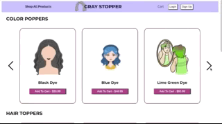

# Gray Stopper
A mock e-commerce website featuring hair dyes, wigs, and wellness products. Gray Stopper was created by a team of pun-loving developers during the Grace Hopper Program at Fullstack Academy.

Gray Stopper is deployed on [heroku](https://gray-stopper.herokuapp.com/).

#### Website Walk Through:

View all products by cruising the carousel  

Add products to cart and checkout. Upon checking out, the stock decreases.  

Admins are able to add, edit, and delete products from the inventory.  

#### Tech Stack:
* [ReactJS](https://reactjs.org/) - Front-end framework
* [ReduxJS](https://redux.js.org/) - Application state management library
* [NodeJS](https://nodejs.org/en/) - Javascript runtime environment for the application
* [Express](https://expressjs.com/) - Middleware for routing HTTP requests
* [Sequelize](https://sequelize.org/) / [PostgreSQL](https://www.postgresql.org/) - Backend database
* [Heroku](https://www.heroku.com/) - Application and database hosting

## Installation

1. Fork and clone repo
2. Npm install
3. Npm run seed
4. Npm run start

## :purple_heart: The Team
[Sofia Javed](https://github.com/sofjaved)  
[Alexandra Langton](https://github.com/alexandralangton)  
[Melissa Lam](https://github.com/mlam0527)  
